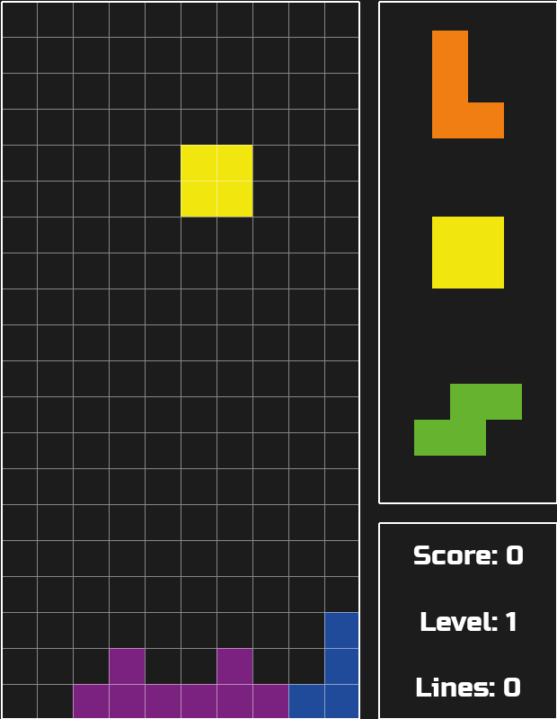

# Tetris Game in Python



A classic Tetris game implemented in Python using the Pygame library. Play the iconic puzzle game right in your terminal!

## Features

- Classic Tetris gameplay mechanics.
- Colorful ASCII graphics for a retro feel.
- Controls: Arrow keys to move, Spacebar to rotate, and Esc to quit.

## Requirements

- Python 3.x
- Pygame (install using `pip install pygame`)

## Getting Started

1. Clone this repository:

   ```bash
   git clone https://github.com/your-username/tetris-python.git
   ```
